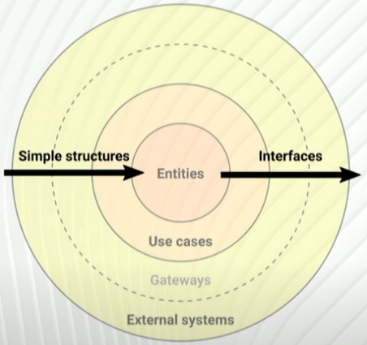

# Circular import error as a friend of a clean architecture

## Concepts

### Separation of concerns

"In computer science, separation of concerns (sometimes abbreviated as SoC) is a design principle for separating a computer program into distinct sections. Each section addresses a separate concern, a set of INFORMATION that affects the code of a computer program."

### Layering based on abstraction level

[Clean Architecture](#clean_architecture)

Lets say that we have 2 modules A and B. If we ever face need for a biderctional dependency we should ask ourselves the following questions:

- can A exist without B?
- is A anyhow useful without B?

## Examples

1. Network

Can a node exists without an edge? Yes. An edge is not a node concern. 

2. [an another simple example]

3. Layering based on abstraction level (database case)

Can the raw data exist (and be useful) without the software? Yes! If you like to do calculations on paper.

Can a software exist without the data? No.

Should a domain logic be concern about what DBMS is used? It most cases, no.

4. GUI accessing simulation engine logic

Can a simulation engine software access GUI elements? God forbid.

## Bibliography

1. https://docs.python.org/3/faq/programming.html#how-can-i-have-modules-that-mutually-import-each-other

1. https://softwareengineering.stackexchange.com/a/12030

1. https://www.reddit.com/r/ProgrammingLanguages/comments/yvkysh/languages_which_support_circular_dependency/

1. Robert C. Martin, "Clean Architecture: A Craftsman's Guide to Software Structure and Design"

1. Leonardo Giordani, "Clean Architectures in Python", https://www.youtube.com/watch?v=C7MRkqP5NRI 